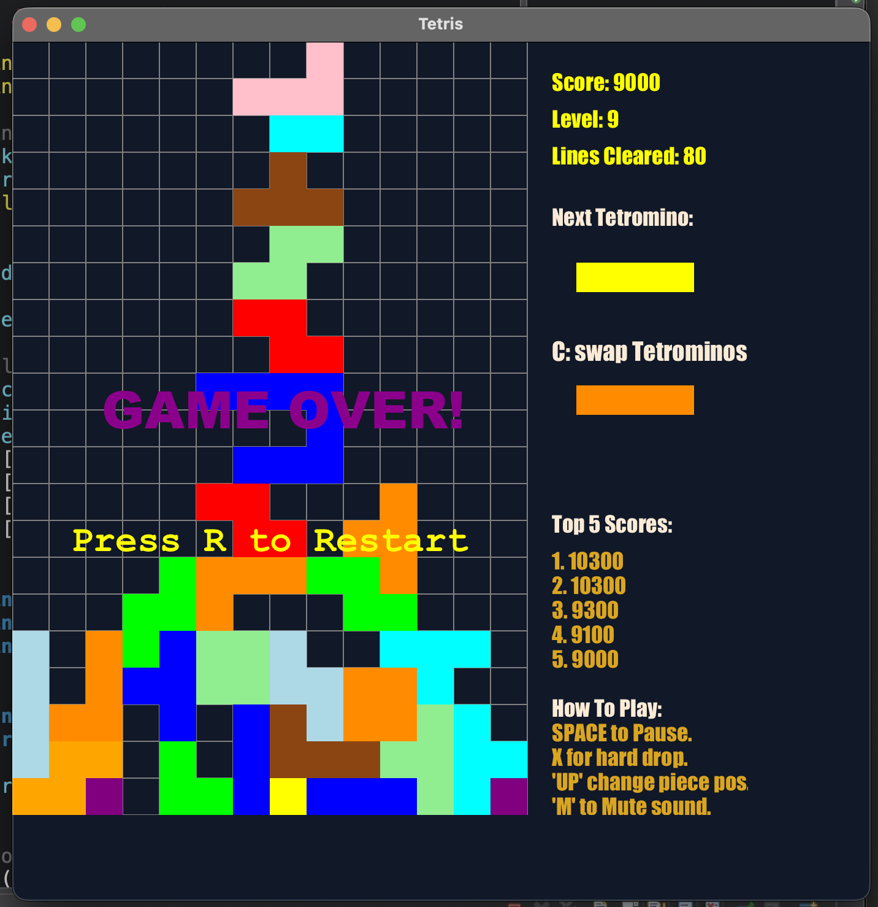
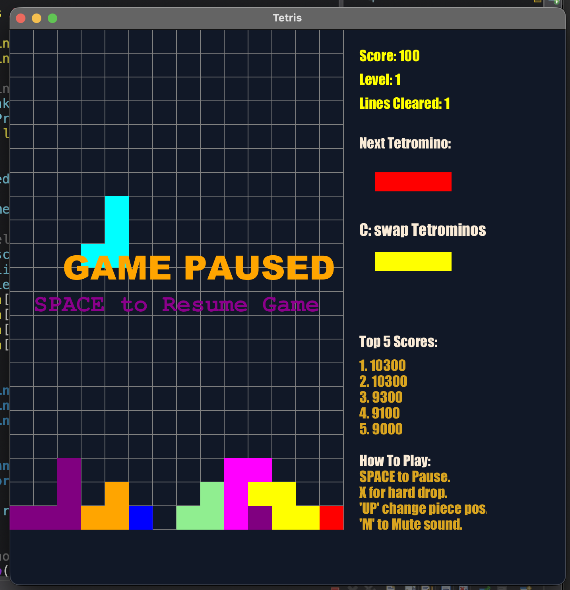

# Tetris Game in JavaFX

A simple **Tetris clone** built in Java using **JavaFX**.
This project is part of my practice to get comfortable with Java, Git, and GitHub.

---

## Features
- Classic Tetris gameplay mechanics
- Colored blocks
- Basic score tracking
- Pop-up game over screen

---

## Getting Started 

### Prerequisites
- **Java 11+** (JDK installed and set as your project JRE)
- **JavaFX SDK**  
  - Download the matching JavaFX SDK (e.g. 21.x) and unzip it.  
  - Add the `lib` folder to your project’s *Modulepath* (not just Classpath) in Eclipse/IntelliJ.
  - When running the app, include VM arguments so the JVM can locate the modules, e.g.:

    ```
    --module-path /absolute/path/to/javafx-sdk-21/lib --add-modules javafx.controls,javafx.fxml
    ```

    Adjust the path and modules list to match your setup.
- An IDE such as **Eclipse** or **IntelliJ IDEA**

### Running the Game
 
1. Clone the repository:
   ```bash
   git clone https://github.com/martiniisluther/TetrisGameInJavaFX.git

2. Open the project in your IDE.
3. Run the Main.java file.


### Project Structure
```
TetrisGameInJavaFX/
├── src/
│   ├── application/
│   │   ├── Main.java
│   │   ├── GameBoard.java
│   │   ├── Tetromino.java
│   │   ├── HighScoreManager.java
│   │   └── SoundManager.java
│   └── screenshots/
│       ├── gameover_screen.png
│       └── pause_screen.png
├── sounds/
│   ├── Title.mp3
│   ├── Stage_Clear.mp3
│   ├── Game_Over.mp3
│   ├── new_high_score.mp3
│   ├── game_level-up.mp3
│   └── Hard_Drop.mp3
├── highscores.txt
├── .gitignore
├── README.md

```

## 🎮 Gameplay Preview

Here’s a sample of the game in action:





#### Goals
- Practice Java OOP concepts.
- Learn Git/GitHub workflow
- Build a fun playable project
